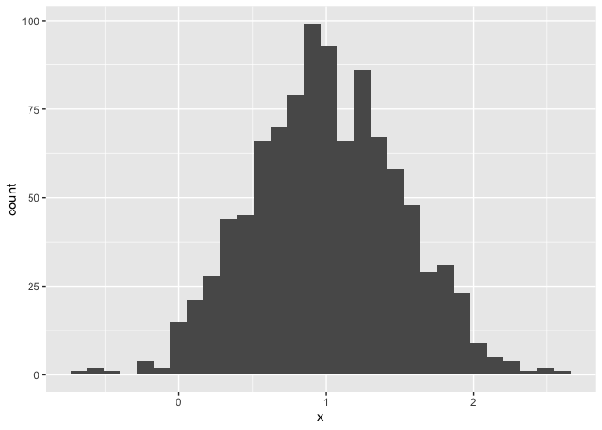
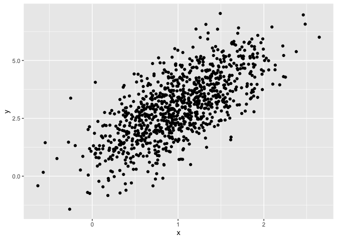
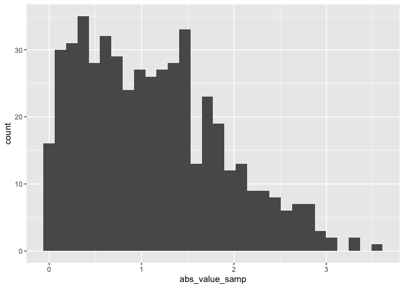

Simple document
================
Matariya Rattanapan
2025-09-11

I’m an R Markdown document!

``` r
library(tidyverse)
```

# Section 1

Here’s a **code chunk** that samples from a *normal distribution*:

``` r
samp = rnorm(100)
length(samp)
```

    ## [1] 100

# Section 2

I can take the mean of the sample, too! The mean is -0.1860575.

# Section 3

This is where I’m going to talk about code chunks.

``` r
samp = rnorm(100)
length(samp)
```

Let’s make a dataframe.

``` r
example.df = 
  tibble(
    vec_numeric = 1:4,
    vec_char = c("my", "name", "is", "jeff"),
    vec_factor = factor(c("male", "male", "female", "female"))
  )
```

I’ll create a new dataframe.

``` r
new_df =
  tibble(
    x = rnorm(100),
    y = 1 + 2 * x + rnorm(100)
  )
```

Let’s make a plot and see how cool

``` r
plot_df = 
  tibble(
    x = rnorm(1000, mean = 1, sd = 0.5),
    y = 1 + 2 * x + rnorm(1000)
  )

plot_df
```

    ## # A tibble: 1,000 × 2
    ##        x      y
    ##    <dbl>  <dbl>
    ##  1 0.906 2.86  
    ##  2 1.47  3.55  
    ##  3 0.918 2.62  
    ##  4 0.869 1.41  
    ##  5 1.34  2.48  
    ##  6 1.53  3.33  
    ##  7 0.364 0.0764
    ##  8 1.75  5.11  
    ##  9 1.46  3.20  
    ## 10 1.78  5.44  
    ## # ℹ 990 more rows

``` r
ggplot(plot_df, aes(x=x)) + geom_histogram()
```

    ## `stat_bin()` using `bins = 30`. Pick better value with `binwidth`.

<!-- -->

``` r
ggplot(plot_df, aes(x=x, y=y)) + geom_point()
```

<!-- -->

# Learning Assessment

``` r
la_df = 
  tibble(
    numeric_samp = rnorm(500, mean = 1),
    greater_0 = numeric_samp > 0,
    abs_value_samp = abs(numeric_samp)
  )

ggplot(la_df, aes(x= abs_value_samp)) + geom_histogram()
```

    ## `stat_bin()` using `bins = 30`. Pick better value with `binwidth`.

<!-- -->

To use inline code, I would do something like: “The sample size in the
new dataframe is 500.”

Something more complex is “The mean of my new variable is 1.1174664.”

# Let’s look at formatting

ll of this is markdown formatting

`italic` or *italic*
